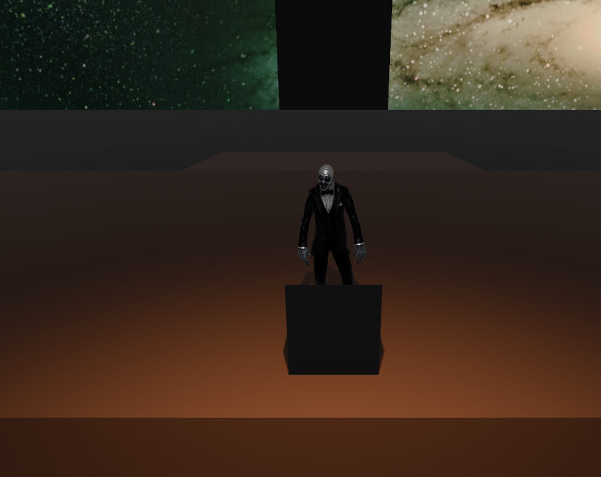
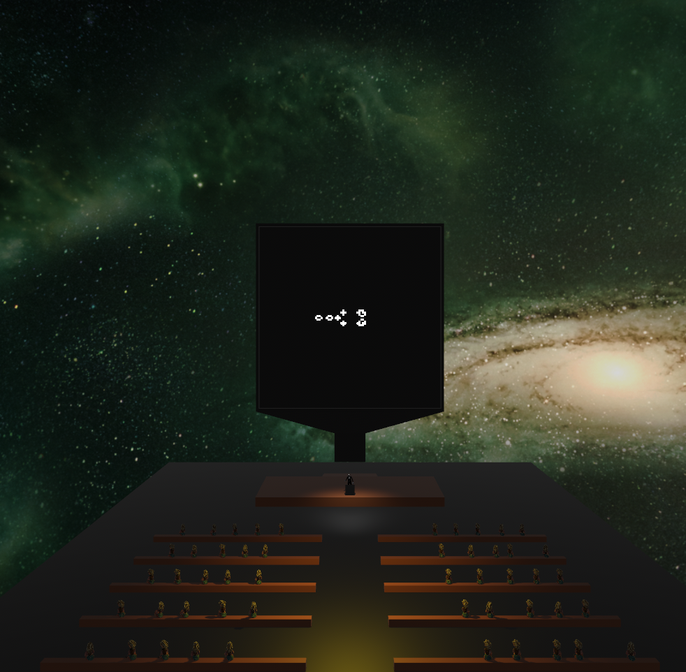

# Conway`s Game of Life
Another implementation made during the study process of Rust and Bevy.  
Presented as a lecture  just for fun.
## Note
Due to the fact that the set of patterns is quite large, please download it by yourself from the  [link](https://conwaylife.com/patterns/all.zip) 
and unzip into assets/patterns/  
  
  
  

