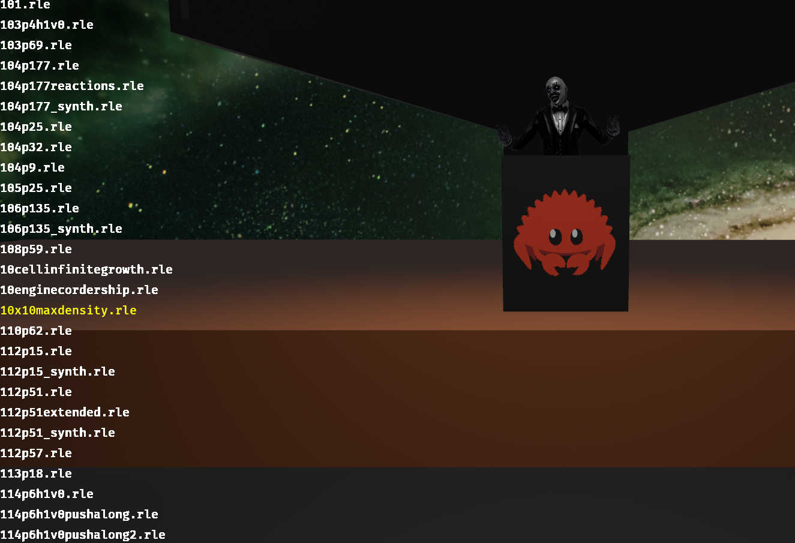

# Conway`s Game of Life
An educational project inspired by the Conway`s Game of Life. 
Since I wanted to practice with animation, I added a small introduction so that it looked like a lecture (just for fun).  

I’m just learning, the code is far from perfect (although it works), so it’s hardly worth mindlessly copying it ;)).  
On the other hand, if someone advises me on how to do everything better, I’ll be incredibly grateful ;)

### Note
Due to the fact that the set of patterns is quite large, please download it by yourself from the  [link](https://conwaylife.com/patterns/all.zip) 
and unzip into assets/patterns/

### Credits 
[conwaylife.com](https://conwaylife.com/) for patterns collection  
[Mixamo](https://www.mixamo.com/) for free and nice animated models

### Screenshots

